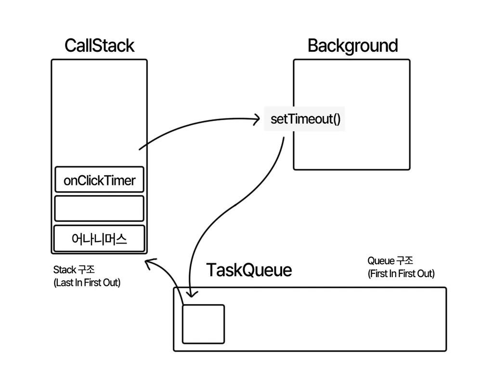

# 시간관련 이벤트

백엔드 CRUD 기능 처리 과정에서 해당 로직이 수행된 시점의 시간을 DB에 함께 저장하는 경우가 많음.<br>
이 때, **이 시간을 새로 생성하는 작업을 프론트엔드에서 처리할 때** 문제가 발생한다.

사용자가 PC의 시각을 실제와 다르게 조작해서 사용하는 경우, 프론트엔드 서버에서 생성한 시간 역시 조작된 시각을 따라가기 때문임.

### 그렇다면?

그렇기 때문에, 시간을 생성하는 작업은 반드시 백엔드에서 이루어져야 한다.

또한, 이 시간은 통상적으로 국제 표준시인 **UTC 시간**을 이용한다.

# 크론탭(CronTab) 이해

한 쇼핑몰 사이트에서 자정이 지나면 진행중인 이벤트를 종료하는 작업이 필요하다고 가정하자.

이때, 가장 간단한 방법은 관리자페이지에 이벤트 마감 버튼을 만들어두는 것임.

하지만 이런 경우에는 담당자가 이벤트 마감 시간까지 계속 대기하고 있어야하는 문제와 더불어 오차가 발생할 가능성이 큼.

### 그렇다면?

특정 시간에 자동으로 이벤트를 발생시켜주면 된다.

이와 같은 작업을 해주는 기능을 **`크론탭(CronTab)`** 이라고 함.

> 리눅스 기반 OS에는 크론탭이 기본으로 깔려있음.

# 이벤트 루프(Event Loop)

```javascript
const onClickLoop = () => {
  console.log("이벤트 루프 시작");

  setTimeout(() => {
    console.log("0초 뒤에 실행될 것임");
  }, 0);

  let sum = 0;
  for (let i = 0; i <= 900000; i++) {
    sum += 1;
  }
  console.log("이벤트 루프 끝");
};
```

위 코드를 실행시켜보면 결과는,<br>
**이벤트 루프 시작 -> 0초 뒤에 실행될 것임 -> 이벤트 루프 끝**<br>

### 왜 이러한 결과가 나오는 것일까?

코드가 순차적으로 실행이 된다고하면, 당연히 setTimeout 함수가 2번째로 실행되어야 한다.

이것은 바로, **`자바스크립트 동작 원리`** 에 의존한다.

위 코드를 실행시키면


실행 순서는 다음과 같다.

1. callStack에서 onClickTimer 함수가 실행된다. (Stack - Last In First Out / LIFO 구조)
2. Background에 setTimeout()을 보내서 실행한다.
3. setTimeout()이 TaskQueue로 전달되어 쌓인다. (Queue - First In First Out / FIFO 구조)
4. TaskQueue에 쌓이는 함수는 **CallStack이 다 비워진 다음 가장 마지막에 실행**된다.

이렇게 자바스크립트가 동작하는 원리를 **이벤트 루프(Event Loop)**라고 함.

여기서 TaskQueue에 있는 함수를 CallStack으로 보내는 역할을 하는 일꾼이 있는데

그것을 **`스레드(Thread)`** 라고 한다.

자바스크립트는 **싱글스레드(Single Thread)** 방식으로 동작한다.

조금 더 구체적으로 표현하자면 **싱글 이벤트 루프 스레드** 라고 할 수 있다.

핵심은, **CallStack이 비어야만 TaskQueue에 있는 작업을 CallStack으로 가져온다는 것**이다.

이렇게, Background 및 TaskQueue로 넘겨지는 작업을 **`비동기 작업`** 이라고 한다.

### 싱글 스레드 vs 멀티 스레드

일하는 스레드가 여러 개면 무조건 좋은 것일까?

반드시 그런 것만은 아니다.

멀티스레드 역시 동시에 일을 처리하는 것처럼 보여도 실제로는 여러 개의 스레드가 컨텍스트 스위칭을 통해 빠르게 수행하고 있는 것이다.

그래서, 멀티스레드라고 해도 싱글스레드보다 두드러지게 빠르지는 않다.

오히려 자바스크립트와 같은 **`이벤트 루프 싱글 스레드`** 의 경우

**오래 걸리는 작업을 TaskQueue로 빼서 처리하기 때문에 높은 퍼포먼스를 낼 수 있다.**

-> 싱글 스레드로 동작하기때문에, 만약 하나의 작업에서 오래걸리면 그 다음 작업이 아예 스탑되는 문제가 발생함

=> 여러 개의 작은 작업들을 많이 실행시키는 것이 오히려 성능 면에서 좋음.

### 블로킹 vs 논블로킹

위에서 설명한 멀티 스레드 예시처럼

하나의 요청에 대한 응답이 와야만 다음 작업을 시작할 수 있는 방식을

**`블로킹(blocking) 방식`** 이라고 한다.

그리고 이벤트 루프 싱글 스레드처럼

하나의 작업이 진행되는 동안 시간이 오래 걸리는 작업은 따로 마련한 공간에 던져

실행하는 방식을 **`논블로킹(non-blocking) 방식`** 이라고 한다.

### 그렇다면, 자바스크립트의 특징은?

**싱글 이벤트 루프 스레드 / 논블로킹 방식**

# 콜백(callback)

콜백 함수는 **`함수의 인자로 들어가는 함수`** 를 말함.

그렇다면, 이러한 **callback 함수를 왜 사용하는 걸까?**

특정한 API 요청이 끝난 뒤, 그 결과 값을 가지고 다른 요청을 실행시켜야 하는 상황을 가정해보자.

그럴 때 이런 식으로 callback 함수를 사용해서 요청을 실행할 수 있다.

```javascript
const onClickCallback = () => {
  // 첫번째 랜덤숫자 api 요청
  const aaa = new XMLHttpRequest();
  aa.open("get", "http://numbersapi.com/random?min=1&max=200");
  aa.send();
  aa.addEventListener("load", (res: any) => {
    const num = res.target.response.split(" ")[0];

    // 두번째 posts api 요청
    const bbb = new XMLHttpRequest();
    bb.open("get", `https://koreanjson.com/posts/${num}`);
    bb.send();
    bb.addEventListener("load", (res: any) => {
      const userId = JSON.parse(res.target.response).UserId;

      // 세번째 UserId api 요청
      const ccc = new XMLHttpRequest();
      cc.open("get", `https://koreanjson.com/posts?userId=${userId}`);
      cc.send();
      cc.addEventListener("load", (res: any) => {
        console.log(res);
        console.log("최종 결과값");
        console.log(JSON.parse(res.target.response));
      });
    });
  });
};
```

위 코드를 보면, 콜백 함수 안에 콜백 함수 형식으로 들어가있어서 매우 난잡하고 가독성이 떨어진다.

지금은 총 3회의 요청만 들어갔지만, API 요청이 2~3번 정도만 더 중첩되어도 코드의 가독성이 심각하게 떨어지게 되는데,
이를 **콜백 지옥**이라고 부른다.

이러한 문제를 해결하기 위해 **Promise**가 등장한다.

# Promise

promise란 자바스크립트의 비동기 처리, 그 중에서도 특히 외부에서 많은 양의 데이터를 불러오는 작업에 사용되는 객체임.

그래서, axios나 fetch 등은 내부적으로 Promise를 이용하여 만든 라이브러리다.

```javascript
const onClickPromise = () => {
  const result = axios
    .get("http://numbersapi.com/random?min=1&max=200")
    .then((res) => {
      const num = res.data.split(" ")[0];
      return axios.get(`https://koreanjson.com/posts/${num}`);
    })
    .then((res) => {
      const userId = res.data.UserId;
      return axios.get(`https://koreanjson.com/posts?userId=${userId}`);
    })
    .then((res) => {
      console.log(res.data);
    });
  console.log(result);
};
```

callback에 비해 코드가 간단해진 것을 확인할 수 있습니다.

또한 콜백 지옥과 같은 현상도 일어나지 않습니다.

promise를 사용할 경우 **각 요청들이 체인처럼 연결**되는데,

이러한 것을 **`프로미스 체인(Promise chain)`** 또는 **`프로미스 체이닝(Promise chaining)`** 이라고 부른다.

그런데, Promise는 호출에 대한 결과값을 상수에 담아 사용하는 것이 불가능하다.

```javascript
const onClickPromise = () => {
  const result = axios
    .get("http://numbersapi.com/random?min=1&max=200")
    .then((res) => {
      const num = res.data.split(" ")[0];
      return axios.get(`https://koreanjson.com/posts/${num}`);
    })
    .then((res) => {
      const userId = res.data.UserId;
      // prettier-ignore
      return axios.get(`https://koreanjson.com/posts?userId=${userId}`)
    })
    .then((res) => {
      console.log(res.data);
    });
  console.log(result);
};
```

위와 같은 함수를 실행하면

결과 값이 완전한 데이터가 아니라 Promise의 형태로 들어오게 됨.

또한, 직관성이 떨어진다.

```javascript
const onClickPromise = () => {
  console.log("여기는 1번입니다~");
  axios
    .get("http://numbersapi.com/random?min=1&max=200")
    .then((res) => {
      console.log("여기는 2번입니다~");
      const num = res.data.split(" ")[0];
      return axios.get(`https://koreanjson.com/posts/${num}`);
    })
    .then((res) => {
      console.log("여기는 3번입니다~");
      const userId = res.data.UserId;
      // prettier-ignore
      return axios.get(`https://koreanjson.com/posts?userId=${userId}`)
    })
    .then((res) => {
      console.log("여기는 4번입니다~");
      console.log(res.data);
    });
  console.log("여기는 5번입니다~");
};
```

위 코드에서 출력은 코드 흐름상 1~5번일 것 같지만, 실제로는 15234로 출력이 된다.

(위에서 학습했듯이, axios를 이용한 비동기 작업이 TaskQueue 안에 들어가, 실행 순서가 뒤로 밀렸기 때문)

코드가 복잡해질수록 이러한 혼란이 더욱 심해질 것이다.

# Async/Await

async / await를 이용하면 코드가 직관적이고 심플해진다.

```javascript
const onClickAsyncAwait = async () => {
  console.log("여기는 1번입니다~");
  // prettier-ignore
  const res1 = await axios.get("http://numbersapi.com/random?min=1&max=200");
  const num = res1.data.split(" ")[0];

  console.log("여기는 2번입니다~");
  const res2 = await axios.get(`https://koreanjson.com/posts/${num}`);
  const userId = res2.data.UserId;

  console.log("여기는 3번입니다~");
  // prettier-ignore
  const res3 = await axios.get(`https://koreanjson.com/posts?userId=${userId}`)
  console.log(res3.data);
  console.log("여기는 4번입니다~");
};
```

**async / await는 promise에만 붙일 수 있다.**

axios가 promise 객체를 이용해 만들어진 라이브러리이기 때문에
async/await를 사용할 수 있는 것임.
